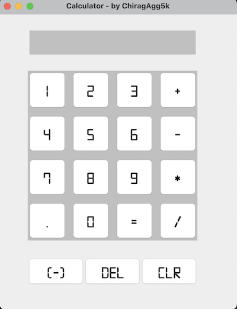

A very basic and simple calculator app made in java. It's the most classic program beginners make when learning a new language. I made this to learn about the language and to get a better understanding of how to use the Java's Swing library.

I followed a tutorial on YouTube to make this. The tutorial can be found [here](https://www.youtube.com/watch?v=dfhmTyRTCSQ).

## How to use
Just run the program and the application shall pop out. Enter the numbers you want to calculate and press the button for the operation you want to perform. The result will be displayed in the text field.

Open to suggestions and improvements. Feel free to use it as you wish.